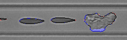

# CytoSegment-Keras
This project accompanies the publication 'Small U-Net for Fast and Reliable Segmentation in Imaging Flow Cytometry' and provides code for training and evaluating various compact U-Net architectures using the Keras framework.

## Dependencies

For training:<br>
- keras==2.10.0 - 2.12.0<br>
- tensorflow=2.10.0 - 2.12.0<br>
- matplotlib==3.7.0<br>
- pandas==2.0.0 - 2.2.0<br>
- Jinja2== 3.0.0 - 3.1.6 <br>


Additional for testing:<br>
- opencv-python==4.7.0.72<br>
- scikit-image==0.21.0<br>


Python 3.10.14

## Model training

1) Create the traning / cross validation set and save the data into following folder structure:<br>
    - "images" containing original grayscale images (pixel values 0-255)<br>
    - "masks" containing groundtruth annotated images (pixel values 0-255)<br>
If you have a test set place it in folder "test_set" having the same structure as training / cross validation set.<br>
2)  Open the cvs file "training_parameters_csv.csv".<br> 

**NOTE: All csv files use ";" as seperator!**
- If your Excel uses comma as separator open the csv file with Notepad (or other text editor) and add "sep=;" as the first line of the csv file and save edits. Afterwards, open the file in Excel and you will see properly seperated columns.

In the "training_parameters_csv.csv" file add the batch sizes you want to use during training, learning rates you want to explore (code uses ReduceLROnPlateau by 50% after 10 epochs), training cross-validation split, number of times you want to repeat the experiments with the same training parameters (due to random effects arrising from GPU training, code used fixed random seed), dropout rate, if image augmentation will be done during training, the original image size in pixels as well as the desired resized pixes size of the images.<br>

**The format of the values in csv file is specified in "guidline_for_training_parameters_csv.xlsx" file that can be fount in example_files folder. This excel file is not used during training of the model and it serves only as guidline.** <br>

#### Recomanded values of training parameters

| the parameter    | value |
| -------- | ------- |
| batch sizes  | [8,16]    |
| learning rates | [0.001, 0.01]     |
| number of epochs    | 150    |
| train-validation split    | 0.85    |
| experimental repeats    | 4    |
| dropout rate    | 0    |
| image augmentation    | TRUE    |

Alternatevely, set dropout to 5% which often leads to better performance of the small U-Net:
| the parameter    | value |
| -------- | ------- |
| dropout rate    | 0.05    |

#### Image size
U-Net reduces the image size in each level by half. Therefore, network will expect images of size divisible by 2**Number of levels.
If you use original U-Net with 4 levels that means that image should be divisible by 16 (for example 512x512).

To avoid resizing images by interpolation the code does croping and padding by mean image value during training.
Example values for image size used in the publication are:
| the parameter    | value |
| -------- | ------- |
| image original pixel size    | (80, 250)    |
| image resized to    | (64, 256)    |

Eventhough 80 is divisible by 16 we have reduces image hight to 64 by cropping 8 pixels up and down to further increase inference time. We were able to do so because those pixels do not contain relevant information but only the walls of the microfuidic channel.
On the other hand, image width was not divisible by 16 and therefore 3 pixels will be padded left and right during traning.

3) Training the model using either model_training_function.py (console) or train_from_code_editor.py (Pycharm, Spyder, ..)
Option one: run it in command line using following sytax:
```
python model_training_function.py --input_folder <your input dir> --output_folder <your output dir> --num_levels <integer specifing LVL> --num_filters <integer specifing FLT> --double_conv <boolian specifing if CNV is 2x (alternatevely it is 1x)>
```
Option two: run it in code editor program (e.g. Spyder) by using train_from_code_editor.py file and changing parameters specified in the file:
```
    input_folder = r"C:/Users/yourusername/Documents/small_unet_traning_folder/input_dir"
    output_folder = r"C:/Users/yourusername/Documents/small_unet_traning_folder/output_dir"
    double_CNV = True
    LVL = 2
    FLT = 8
    traning_function(input_folder, output_folder,
                     double_CNV, LVL, FLT)
```

### Output of model training
In the output directory you can find:
1. Folder with name that describes small unet arhitecture used during training. For example "U-net_2_LVL_8_FLT_2xconv"
That folder contains: 
    
    - "U-net_2_LVL_8_FLT_2xconv_results.csv": This file contains the summarized training results for each combination of batch size (BS), learning rate (LR), and training run. It reports the highest Dice Similarity Coefficient (DSC) achieved on the respective cross-validation set. The training configuration yielding the best DSC is highlighted in orange.
    - "U-net_2_LVL_8_FLT_2xconv_parameters.cvs": This file contains the list of parameters used in model training. 
    - "Cross_vall_files.csv": This file contains the list of files selected for cross-validation set (defined by random seed).
    - "unet_arhitecture.txt": This file contains summary of model arhitecture.

2. Several folders with names that contain batch size (BS), learning rates (LR) used during training and which experimental repeat was it. For example: "LR0.01_BS16_run0". In each of these folders are:
    - h5 file with keras model that had best Dice score on cross validation set during training. Model name is epoch number and cross-validation Dice score seperated by dot. Additionally to keras standard output, in h5 file as attributes are saved values used for image preprocessing that are needed for model inference.
    - jpg images with Dice, IoU and Focal Tversky Loss for each epoch.
    - "training_results.csv": contains Loss, IoU, Dice, Precision and Recall on training set and cross-validation set for each epoch. Additionally, it contains "Epoch_Max_Val_Dice" column with epoch number and when Dice score on cross-validation set had maximal value and "Max_Val_Dice" column with value of that Dice score.

In case you want also TensorBoard output uncomment "keras.callbacks.TensorBoard(log_dir=output_subfolder / 'logs'" in line 250 of main_training.py file.


## Model testing

1) Create testing set and save the data into following folder structure:<br>
    - "images" containing original grayscale images (pixel values 0-255)<br>
    - "masks" containing groundtruth annotated images (pixel values 0-255)<br>
2) run test_results_per_model.py file.
Option one: run it in command line using following sytax:
```
python test_results_per_model.py --model_folder <folder where the model you want to test is> --test_set_folder <folder where yout test set is> --plot_results <boolian specifing if results on test images fill be saved as png images>
```
Option two: run it in code editor program (e.g. Spyder) by changing parameters specified at the end of the file:
```
if __name__ == "__main__":
    # defined by user
    model_folder = r"C:/Users/yourusername/Documents/small_unet_traning_folder/output_dir/U-net_2_LVL_8_FLT_2xconv/LR0.01_BS16_run0"
    test_set_folder = r"C:/Users/yourusername/Documents/small_unet_traning_folder/input_dir/test_set"
    plot_results = True
    test_set_results(model_folder, test_set_folder, plot_results)
```
In .h5 file as attributes are saved "image_mean", "image_std", "image_org_size", "image_resized" values used during the inference for image preprocessing.
Mean and Std values of the training set are used for standardization of the test set data, while original and resized pixel sizes of the images are used for resizing the test set images for the inference.

### Test set output:
1) file "test_set_results.csv" (NOTE: sep=;)
with Dice, IoU, Accuracy, Precission, Recall per test set image and at the end of the file are average, median and std values per test set.
2) if "plot_results = True" as part of the output will be a folder "test_set_images" with images that contain comparison between ground truth annotation and predicted mask on top of the original image.
An example of such image is: 

<center>

</center>

Where blue marks **FP** pixels and red **FN** pixels. Contour of the predicted mask is drawn in black.
